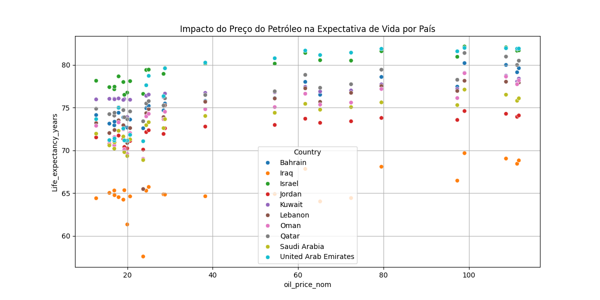
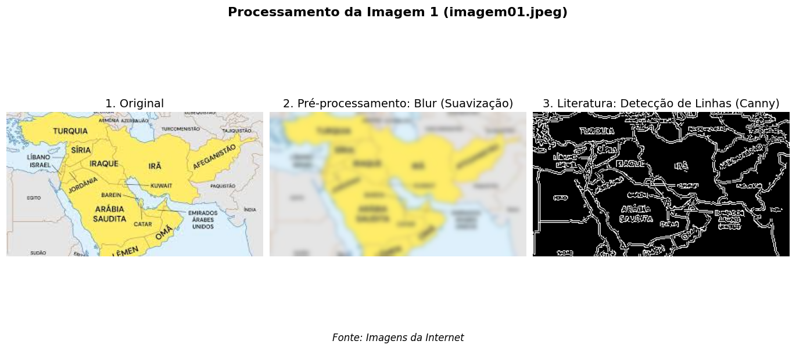
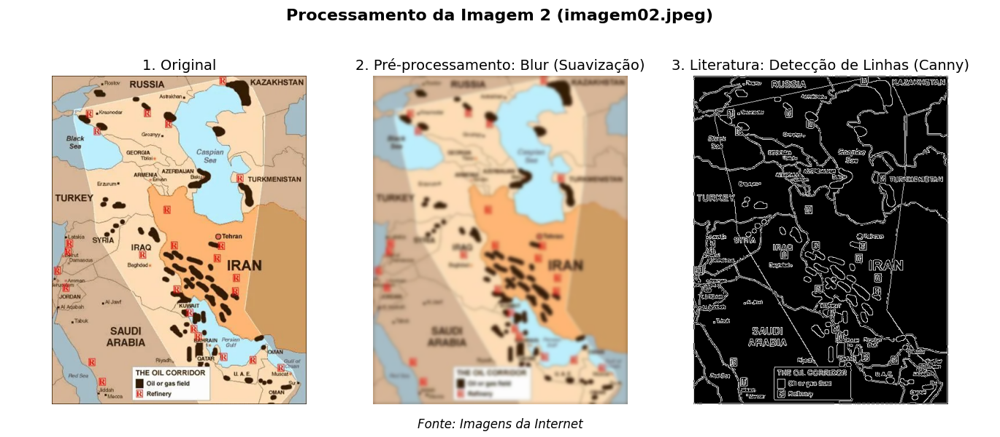
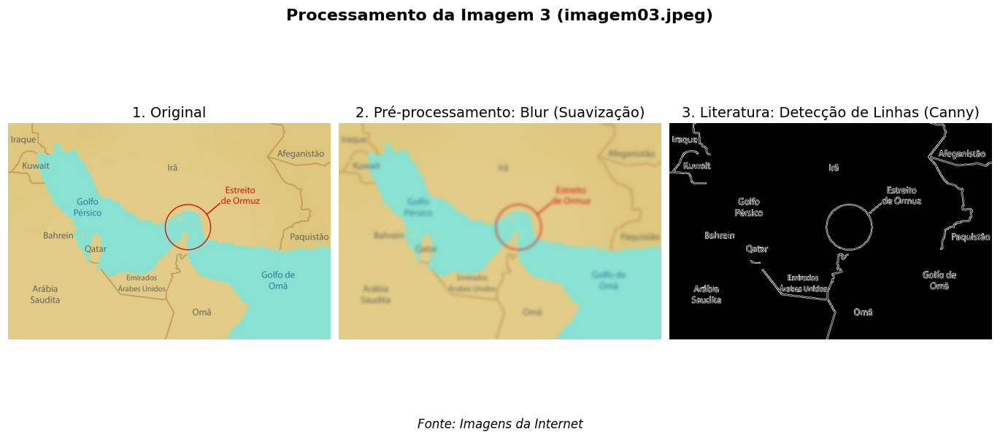
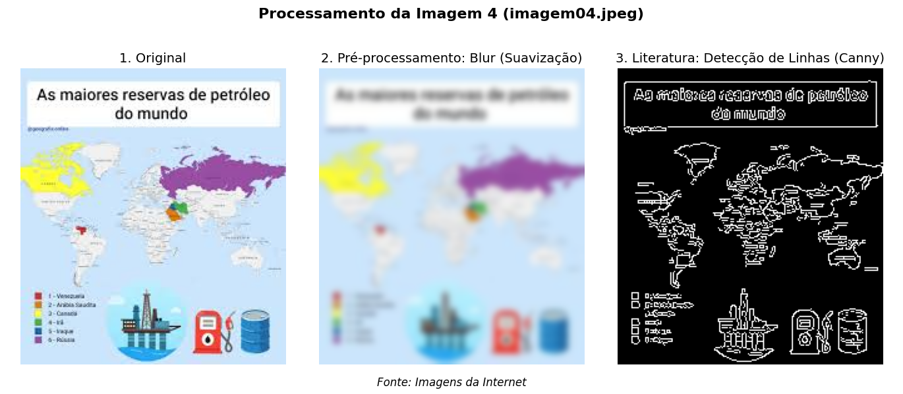

# Análise de Dados Econômicos (Petróleo) e Processamento de Imagens 

Este projeto apresenta uma análise integrada utilizando técnicas de **Ciência de Dados** e **Processamento de Imagens**, atendendo aos requisitos da atividade ATIV-03.
Aproveitei a realidade atual para fazer a minha atividadebaseada em fatos que estão ocorrendo. Sobre o oriente.csv, na verdade tive que renomear pois o git não permitia o nome original que era "oriente_medio.csv", esse arquivo foi baixado no kaggle, mas possía outro nome em inglês, alterei o nome 
para facilitar a comprrensão dos dados

## 1. Metodologia de Dados (Pandas)
Utilizei a biblioteca **Pandas** para todo o ciclo de vida dos dados, desde a carga até a análise descritiva.

* **Importância do Pandas:** A biblioteca permitiu a manipulação eficiente de DataFrames, facilitando a união de fontes de dados heterogêneas.
* **Construção de Estruturas:** Foram interpretados e construídos DataFrames a partir dos arquivos `oriente.csv` e `mundial_petroleo.csv`.
* Esses dados foram retirados do site Kaggle, e para não ficarem imensos escolhi alguns dados.*
* **Limpeza e Tratamento:** Aplicamos a remoção de valores ausentes (`dropna`) e a correção de dados inconsistentes para garantir a qualidade das predições.
* **Operações Realizadas:** Executamos seleção de colunas específicas, filtragem por países, ordenação cronológica e agregação de dados para médias anuais.
* **Análise Descritiva:** Utilize funções estatísticas e de correlação para entender como o preço do petróleo impacta diretamente o PIB da região.

---

## 2. Métodos da Literatura vs. Próprios
Comparamos dois modelos de Machine Learning para prever o crescimento do PIB:

### Visualização do Resultado gráfico

#### Imagem 01

**Fonte:** Imagens geradas com pandas , matplotlib e seasborn.

| Tipo | Método | Descrição |
| :--- | :--- | :--- |
| **Literatura** | Regressão Linear | Modelo estatístico clássico de relação linear entre variáveis. |
| **Próprio** | Random Forest | Modelo de ensemble não-linear para capturar complexidades dos dados. |

### Métricas de Resultados
| Método | Erro Médio Quadrático (MSE) |
| :--- | :--- |
| Literatura (Linear) | 119.69 |
| Próprio (Random Forest) | 141.41 |

##  Análise Exploratória: Preço do Petróleo vs Expectativa de Vida

### **Metodologia**
O gráfico de dispersão foi gerado a partir da junção dos datasets `oriente.csv` e `mundial_petroleo.csv`, correlacionando a variável preditora `oil_price_nom` (preço nominal do petróleo) com a variável resposta `Life expectancy_years` (expectativa de vida em anos), segmentada por país.

### **Insights Extraídos**

| País | Observação |
|------|------------|
| **Bahrain** | Expectativa de vida ~65 anos, concentrada em preços mais baixos |
| **Israel** | Pontos entre 70-75 anos, distribuição uniforme nos preços |
| **Kuwait** | Similar a Israel, com leve concentração em preços médios |
| **Emirados Árabes** | Maior expectativa (80-85 anos), possivelmente ligada a investimentos pós-petróleo |

### **Conclusão Preliminar**
Não há correlação linear evidente entre preço do petróleo e expectativa de vida quando analisados todos os países em conjunto. No entanto, as diferenças entre países sugerem que **fatores socioeconômicos locais** são mais determinantes para a longevidade do que a variação do preço da commodity.

---

## 3. Processamento de Imagens (OpenCV)
Realizamos o tratamento de 4 imagens utilizando métodos de pré-processamento e literatura.

* **Gaussian Blur (Pré-processamento):** Utilizado para suavizar a imagem e reduzir ruídos que poderiam atrapalhar a análise.
* **Canny Edge Detection (Literatura):** Método para detecção de linhas e bordas estruturais nas imagens.

### Visualização dos Resultados

#### Imagem 01

**Fonte:** Imagens da Internet.

#### Imagem 02

**Fonte:** Imagens da Internet.

#### Imagem 03

**Fonte:** Imagens da Internet.

#### Imagem 04

**Fonte:** Imagens da Internet.

---

## 4. Conclusões e Contribuições
* **Compilado:** A análise mostrou que modelos lineares são robustos para prever o PIB baseado no petróleo na região estudada.
* **Contribuições:** Demonstração prática de integração entre análise tabular e processamento de imagem em um único fluxo de trabalho.
* **Futuros Estudos:** Exploração de Redes Neurais Convolucionais (CNNs) para análise automática das imagens dos mapas.

